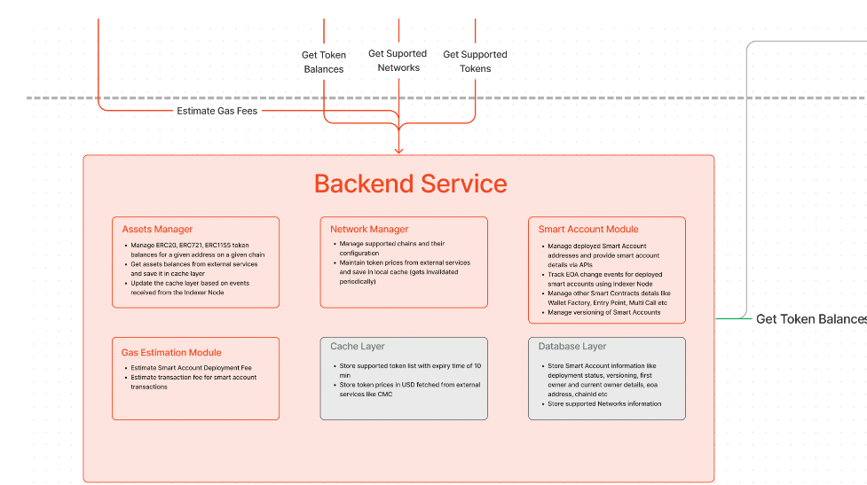

## Thông tin về Backend Service

## Giải thích chức năng của từng module trong file Backend

- **Network Manager:**
  - **token-price**: Trong file **CMCTokenPriceManager.ts** thì sẽ có một hàm là **setUp()** được sử dụng để gọi lên **Api của Coinmarketcap** với mục đích là lấy giá của từng token trên các chain tùy chọn và lưu nó vào trong cache với khóa key là **NETWORK_PRICE_DATA**
  - **network**: file **EVMNetworkService** dùng để viết ra các service sẵn để có thể dễ dàng gọi hơn ví dụ khi muốn tính phí gas trong 1 transaction. Thực chất là họ gọi hàm **estimateGas** từ **Provider** (cái này mình chưa dùng bao giờ nhưng giờ mới biết)
