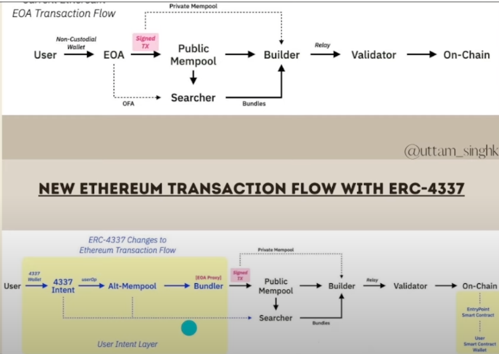
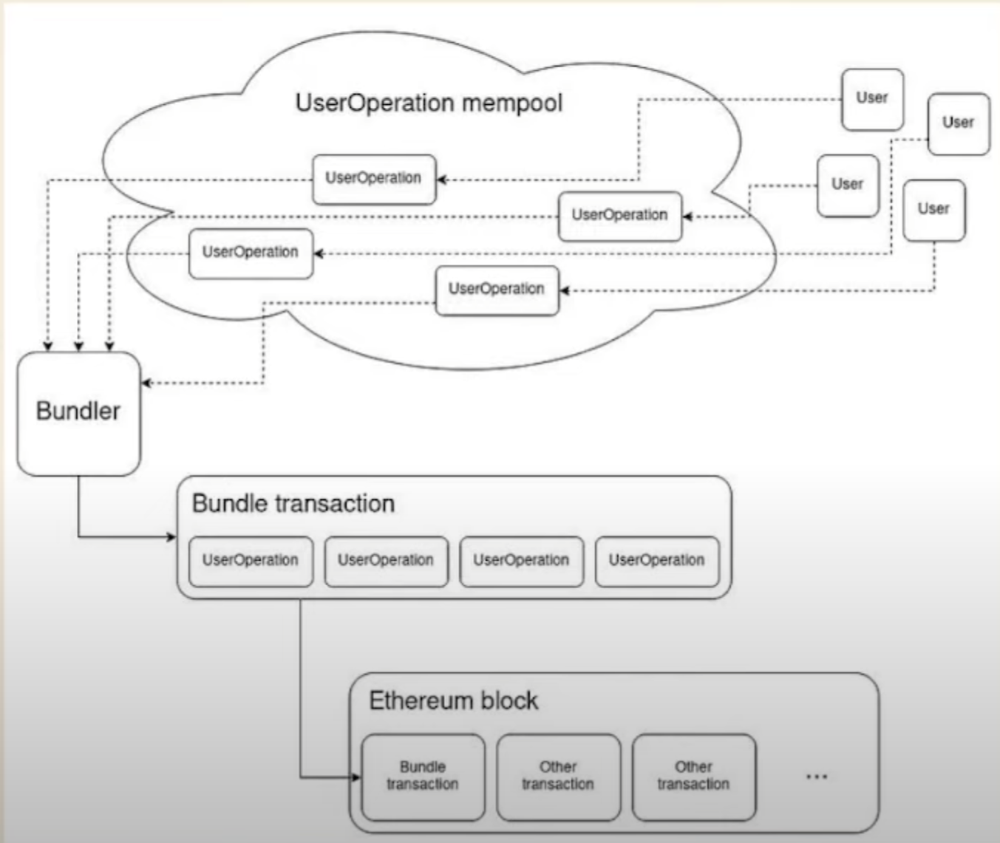
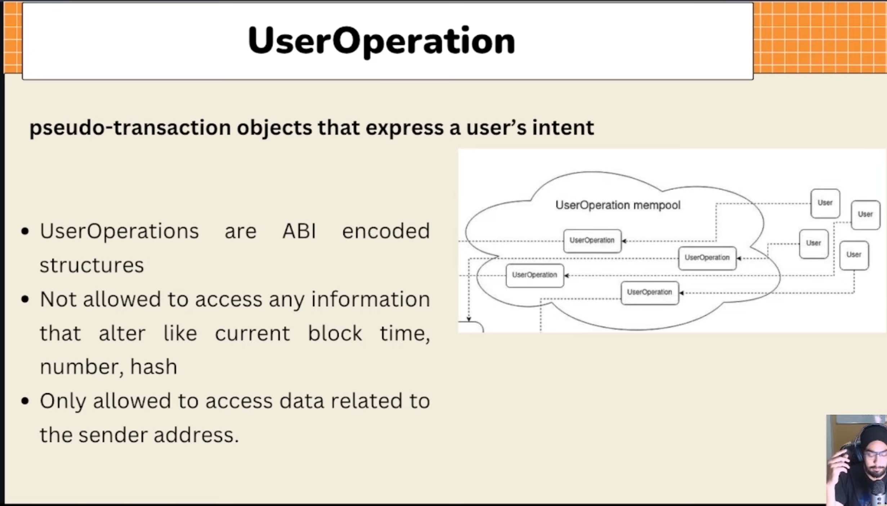
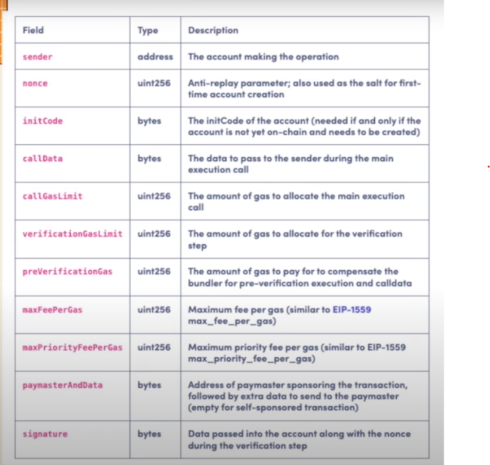

## How core of Account Abstraction works ?

- Basically, erc4337 work as a higher layer for user(**User Intent Layer**) before interacting iwth Public Mempool as **EOA**
  

## Work flow of Bundler:

## Main components of Account Abstraction:

- **User Operation:**
  - Definition:
    
  - Fields:
    
