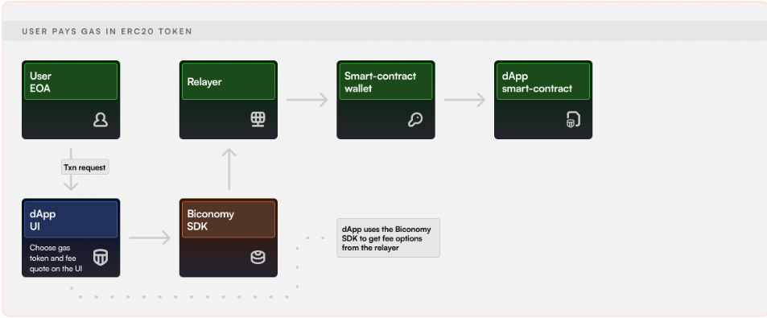

## Thông tin về ERC20 Paid Transactions của Biconomy

- Hiện tại thì mới đang hỗ trỡ 3 loại ERC20 tokens là DAI, USDT, USDC.
- Để sử dụng được thì phải gọi thông qua một SDK gọi là Biconomy SDK.
- Ưu tiên nghiên cứu cách triển khai **Relayer Node** của bọn này

## Flow:

## Reference:

1. https://github.com/bcnmy/relayer-node
2. https://docs.biconomy.io/guides/react.js/user-pays-gas-in-erc20-tokens
3. https://github.com/bcnmy/sdk-examples/tree/master/react-biconomy-web3Auth
4. https://github.com/bcnmy/sdk-demo
5. https://github.com/bcnmy/hyphen-ui/tree/demo-sdk
