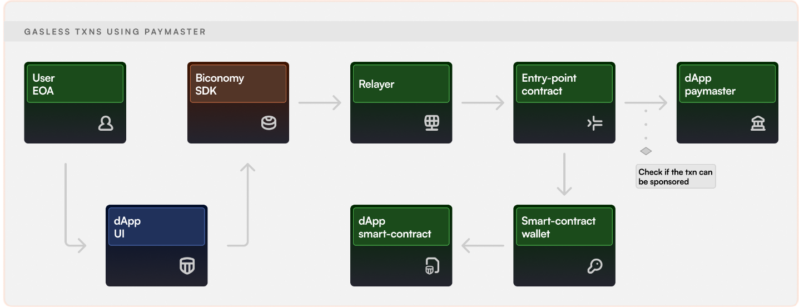
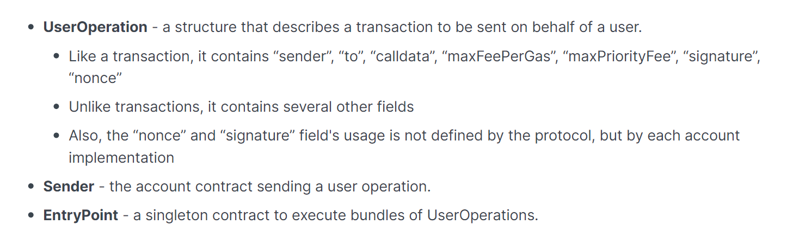

## Thông tin về Gasless Transactions của Biconomy

- Theo Biconomy, mình sẽ có một **Paymaster** contract đóng vai trò như là một "Gas Tank" (Cũng như là chuẩn **ERC4337**)
  => Sẽ trả phí cho người dùng

## Flow:

- **EIP-4337** giới thiệu **higher-layer pseudo-transaction object** được gọi là "UserOperation". Mỗi người dùng sẽ gửi **UserOperation Objects** vào một **Mempool** riêng. Một lớp actors được gọi là **bundlers (có thể là Miners hoặc là người dùng gửi transactions thông qua một Bundler Marketplace)** sẽ đóng gói các objects này thành một transaction tạo ra một **handleOps** gọi lên **Entry Point** contract

- **Paymaster** là các contract được sử dụng bởi **Dapps** để trả phí gas cho người dùng. Để có thể cấp quyền gasless, mình có thể sử dụng pre-deployed **BiconomyVerifyingPaymaster**. Nó đã được cấu hình sẵn và rất dễ sử dụng. Mình chỉ cần chuyển tokens vào (để sử dụng cho gas sponsorship)

- **Flow in Biconomy SDK:**
  - Người dùng khởi tạo transaction và cung cấp signature thông qua Biconomy SDK (**Hiện tại chưa rõ nó làm như nào, mình sẽ bổ sung sau khi tìm hiểu được SDK!**)
  - **Signature** sẽ được gửi đến **Relayer(Bundler)**, sau đó gửi transaction on-chain thông qua **Entry Point** contract. **Entry Point** contract sẽ xác thực chữ kí và sử dụng **Paymaster** để trả phí gas.

## References:

1. https://docs.biconomy.io/guides/biconomy-dashboard
2. https://docs.biconomy.io/guides/react.js/gasless-transactions
