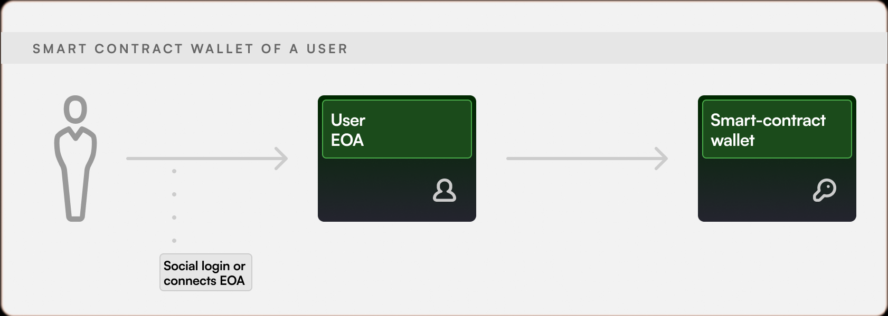
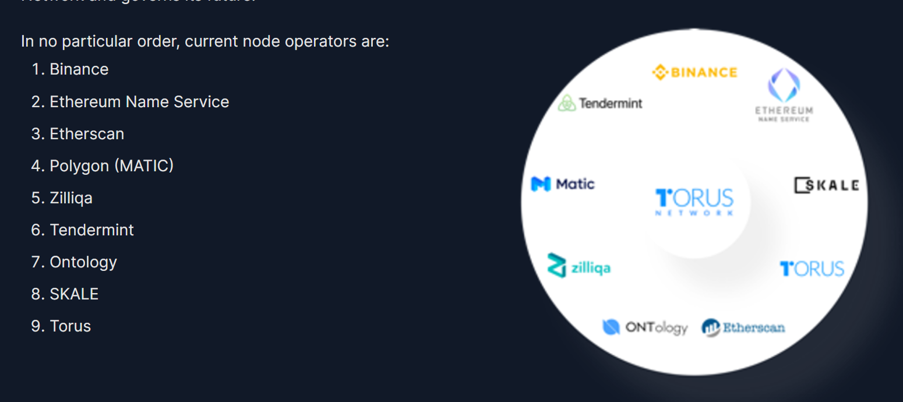
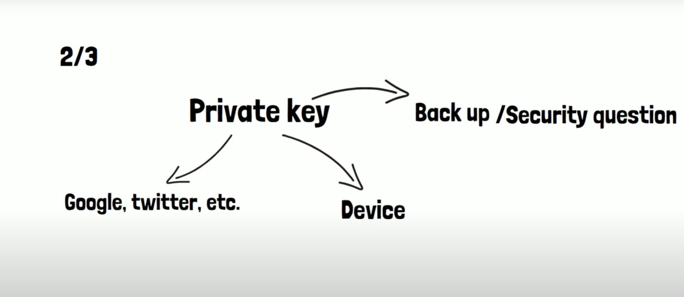

## Điều cần chú ý về Private Key trong việc quản lí Account của người dùng trong ERC4337

## **Flow: (theo chuẩn Biconomy)**

- Khi một người dùng login vào một hệ thống của chúng ta, thì họ sẽ ngay lập tức có được một địa chỉ "EOA" mà không cần deploy bất kì cái gì lên chain. Smart contract wallet (SMW) sẽ được deploy cùng với Transaction đầu tiên từ người dùng (Chú thích: A Smart Contract Wallet is a smart contract associated with each user's EOA).

- SMW là một account lưu trữ tài sản. Nó cung cấp thêm lớp bảo mật so với EOA (chỉ dùng duy nhất 1 private key)
  => Người dùng có thể deposit hoặc withdraw funds bất kì lúc nào

- Hỗ trợ multichain vì địa chỉ của SMW sẽ là cố định ở trên các chain khác nhau (Thông qua việc sử dụng hàm Create2 trong Solidity)

## **Private Key Scheme:**

- Khóa private key của người dùng sẽ được chia thành 3 phần
  - **Social/OAuth Share**: Trên mạng xã hội (Ex: Google, twitter, etc), phần này sẽ được chia làm 9 phần và được lưu trữ bơi 9 node được chạy trên "Ecosystem Stakeholder"
    
  - **Device Share**: Thiết bị của người dùng
  - **Backup Share**: Dùng cho việc backup để khôi phục "Private Key" ban đầu

=> Khi mà một người dùng muốn dùng "Private Key" của họ để kí "Transaction", thì họ sẽ lấy 5 phần để khôi phục lại **Social Share**, sau đó lấy **Device Share** hoặc **Backup Share** để khôi phục lại "Private Key" ban đầu

## **Questions:**

- Liệu việc chia "Private Key" có ảnh hưởng đến tính bảo mật không ? Vì khi chia nhỏ thì range sẽ nhỏ lại!
  - **Trả lời**: Có, tuy nhiên mình có thể tăng bảo mật của khóa key từ 2/3 lên 3/4 và thêm **Authentication Factor** như là "Hardware Device"

## **References:**

https://web3auth.io/docs/infrastructure/key-management#improvements-to-key-recovery-and-redundancy
