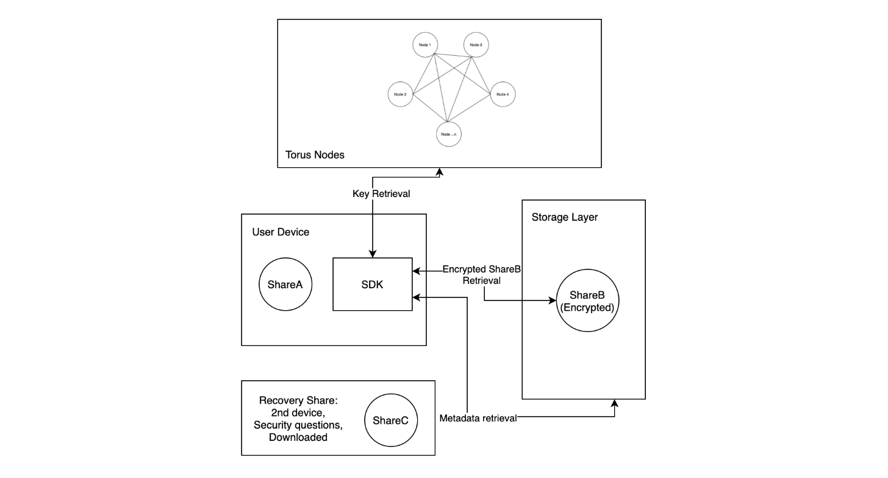
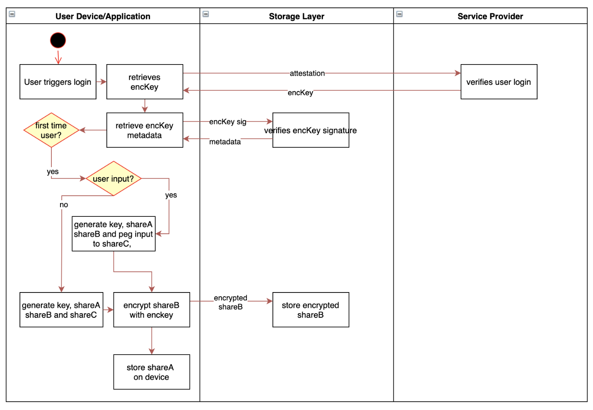
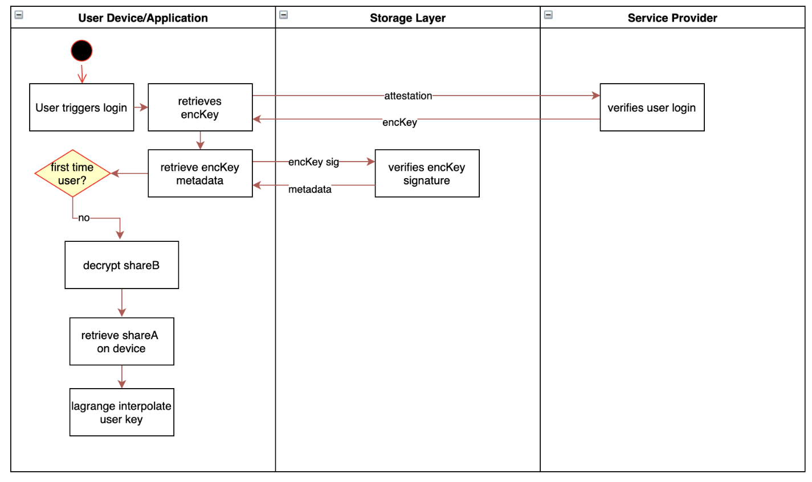

## Kiến trúc của Torus trong việc quản lí khóa

- Torus là một công cụ open-source cho việc quản lí khóa mã nguồn mở

**Components:**

- **Torus node** cung cấp key cho người dùng thông qua các yếu tố xác thực như Oauth, email, biometrics,.... Tuy nhiên **Torus node** không cần phải trả về **private key**
  **Private key** có thể lấy được thông qua một **Encryption Key** hay còn gọi là **encKey**

- **Storage Layer** là một kho lưu trữ dữ liệu được mã hóa. **Private key** sẽ được lấy ở đây thông qua **encKey** tại đây. Ngoài ra nó còn gồm các thông tin như **User Threshold**, **Linked Devices**.

- **User Device**: Phụ thuộc vào thiết bị người dùng để lưu trữ **shares** (Chú thích: là các mảnh được tách từ private key)

- **Recover Share** Tên thôi đã đủ rõ nó là gì rồi

**Key Initialization And Reconstruction:**

- **Initialization**:
  

- **Reconstruction**:
  
